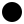

svgs
====

.. normal image processing

image test default

.. image:: svg.svg

image test (viewbox)

image test (no hints)

.. image:: svg-none.svg

.. doctype should be injected into this document
.. =============================================

handle missing doctype svg

.. image:: svg-doctype.svg

.. applying length/scale options into the svgs
.. ===========================================

width-scaled at 75px

.. image:: svg.svg
    :width: 75px

height-scaled at 2in

.. image:: svg.svg
    :height: 2in

width/height-scaled at 50px/100pc

.. image:: svg.svg
    :height: 50px
    :width: 100pc

width at 100px scaled to 200%

.. image:: svg.svg
    :scale: 200%
    :width: 100px

.. applying length/scale options based on viewbox
.. ==============================================

viewbox-based width-scaled at 50px

viewbox-based height-scaled at 200px

