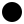
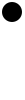

svgs
====

.. normal image processing

.. image:: svg-none.svg

.. doctype should be injected into this document

.. viewbox sizes should be added into height/width

.. applying length/scale options into the svgs

.. applying length/scale options based on viewbox

